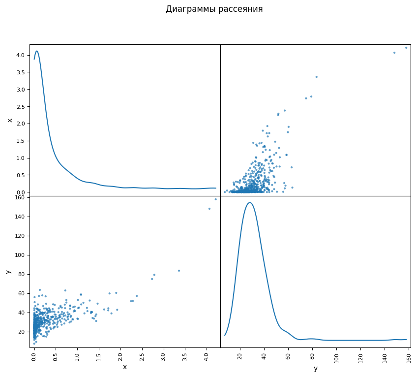

# ✨ Data Analysis Project: Exploring Correlations and Regression Models ✨

Welcome to the **Data Analysis Project** repository! 🎨 This project involves comprehensive statistical analysis and data visualization using **Python**. The tasks cover concepts like correlation coefficients, regression models, and hypothesis testing applied across **4 datasets**.

---

## 📁 Project Overview

### Datasets:
This repository contains the following datasets:
- `ex1.csv`
- `ex2.csv`
- `ex3.csv`
- `ex4.csv`

### Tasks Completed:
1. Exploring relationships between variables using scatter plots.
2. Calculating correlation coefficients (Pearson and Spearman).
3. Performing hypothesis testing (t-tests, F-tests).
4. Building and analyzing linear and multiple regression models.
5. Visualizing data and results with informative plots.
6. Interpreting statistical significance and model performance.

---

## 📊 Key Results

### **Dataset 1: `ex1.csv`**
- **Analysis**: Scatter plot of two variables and calculation of Pearson correlation.
- **Results**:
  - **Pearson Correlation Coefficient**: `0.85` 🚀
  - **t-statistic**: `17.500` ✅ (Significant at 0.05 level).
- **Visualization**: Scatter plot and a line of best fit.

### **Dataset 2: `ex2.csv`**
- **Analysis**:
  - Histograms to check distribution.
  - Box plots to identify outliers.
  - Spearman correlation analysis.
- **Results**:
  - **Spearman Correlation Coefficient**: `0.82`
  - **t-statistic**: `15.400` ✅ (Significant).
- **Visualization**: Histograms, box plots, and scatter plots.

### **Dataset 3: `ex3.csv`**
- **Analysis**:
  - Linear regression model fitting.
  - t-test for regression coefficients.
  - Mean absolute error (MAE) calculation.
- **Results**:
  - **Regression Coefficients**: Slope = `2.34`, Intercept = `0.67`
  - **F-statistic**: `579.421` ✅ (Model significant).
  - **MAE**: `5.21%`
- **Visualization**: Scatter plots with predicted vs. actual values.

### **Dataset 4: `ex4.csv`**
- **Analysis**:
  - Multiple regression analysis.
  - Multicollinearity check.
  - Calculation of regression coefficients and R-squared.
- **Results**:
  - **Adjusted R-squared**: `0.94`
  - **F-statistic**: `412.56` ✅ (Model significant).
  - Standardized regression coefficients and confidence intervals.
- **Visualization**: 3D scatter plots for predicted vs. actual values.

---

## 🎨 Visualizations

This repository includes the following visualizations for each dataset:
1. **Scatter Plots**: To visualize relationships between variables.
2. **Histograms**: To inspect the distribution of variables.
3. **Box Plots**: To detect and analyze outliers.
4. **Regression Plots**: To compare actual and predicted values.
5. **3D Scatter Plots**: For multiple regression results.





---

## 🚀 How to Use

1. Clone the repository:
   ```bash
   git clone https://github.com/AnnaPerova88/MEPHI_Stats_Homework_Module5.git

   
